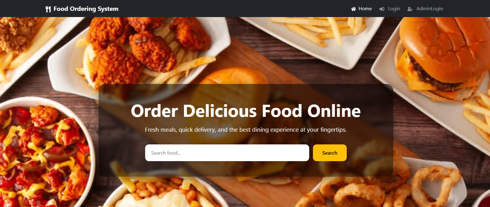
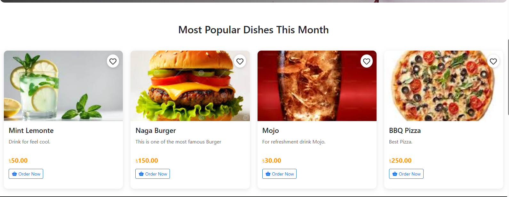
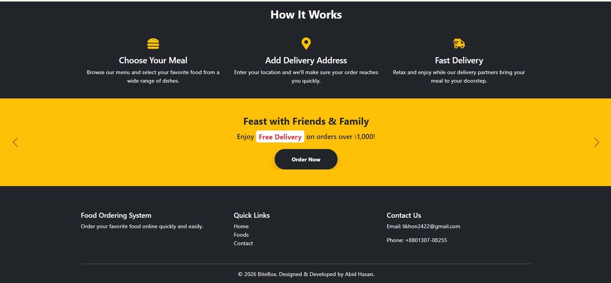
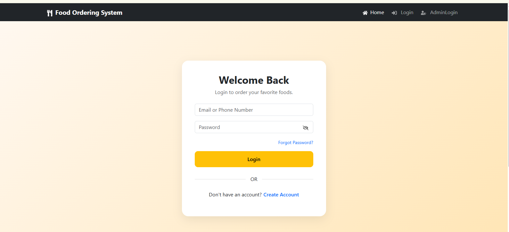

# 🍔 Online Food Ordering System

A full-stack Online Food Ordering System built with React.js and Django REST Framework.

---

## 🚀 Features

### User

- User Registration & Login
- JWT Authentication
- Forgot Password
- Profile Management
- Change Password
- Search Food
- Browse Menu by Category
- Wishlist
- Shopping Cart
- Checkout
- My Orders

### Admin

- Dashboard
- Category Management
- Food Management
- Customer Management
- Order Management
- Sales Report
- Order Report
- PDF Export
- Excel Export

---

## 🛠 Tech Stack

### Frontend

- React.js
- Bootstrap 5
- Axios
- React Router
- React Toastify

### Backend

- Django
- Django REST Framework
- JWT Authentication
- MySQL

---

## 📷 Screenshots

## 🏠 Home Page






## 🔐 User Login


---

## ⚙ Installation

### Clone repository

```bash
git clone https://github.com/abidhasan2422/Food-Ordering-System
```

### Backend

```bash
cd backend

python -m venv venv

venv\Scripts\activate

pip install -r requirements.txt

python manage.py migrate

python manage.py runserver
```

### Frontend

```bash
cd frontend

npm install

npm start
```

---

## 📁 Folder Structure

```
Online Food Ordering System
│
├── backend
│
├── frontend
│
└── README.md
```

---

## 👨‍💻 Author

**Abid Hasan Likhon**

LinkedIn:
https://www.linkedin.com/in/md-abid-hasan-likhon-0b6402321/

GitHub:
https://github.com/abidhasan2422