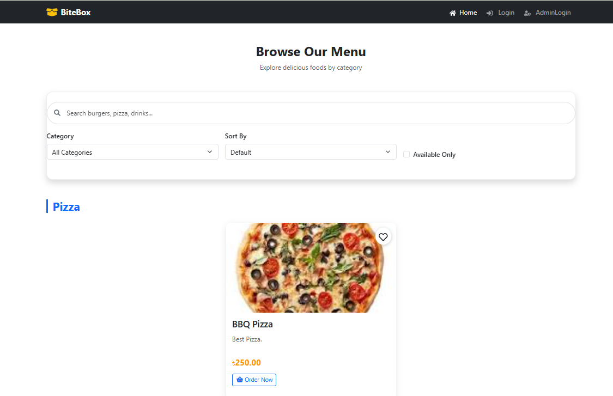
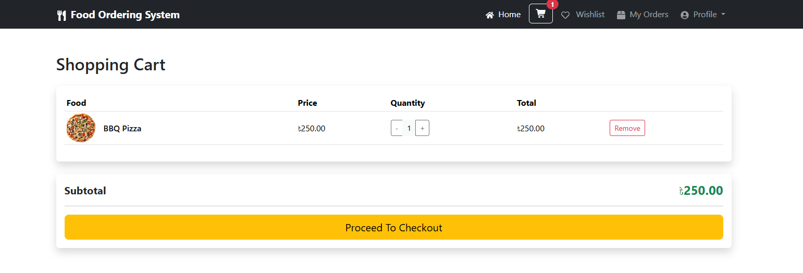
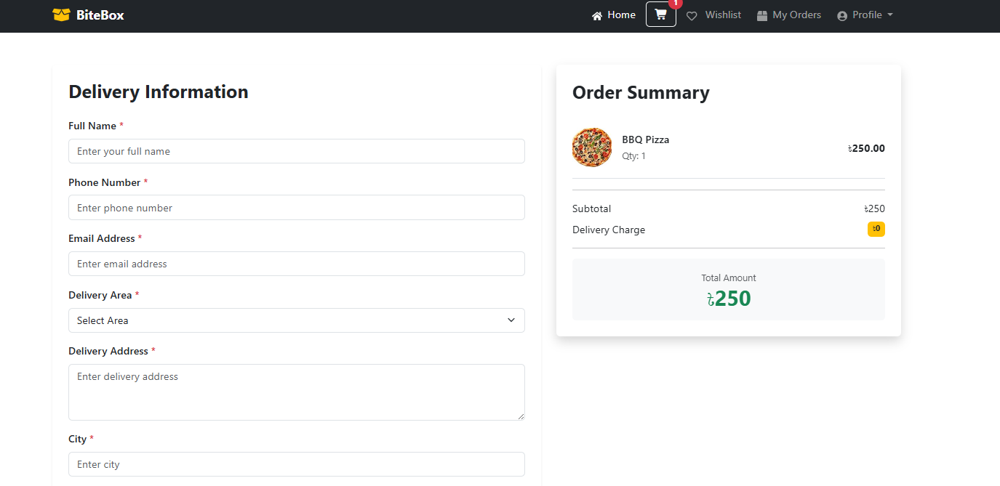
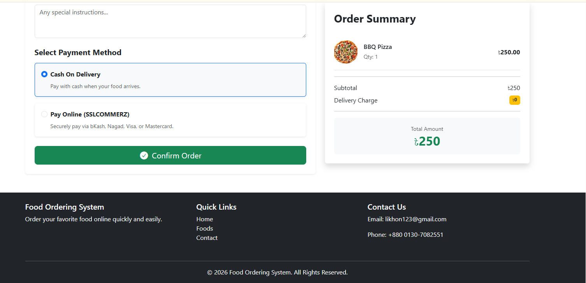
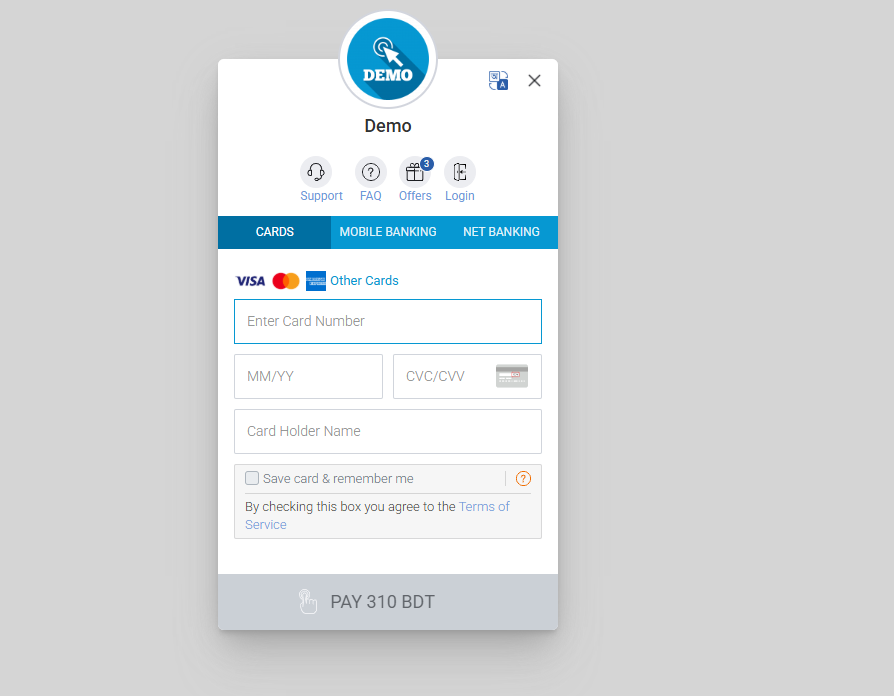
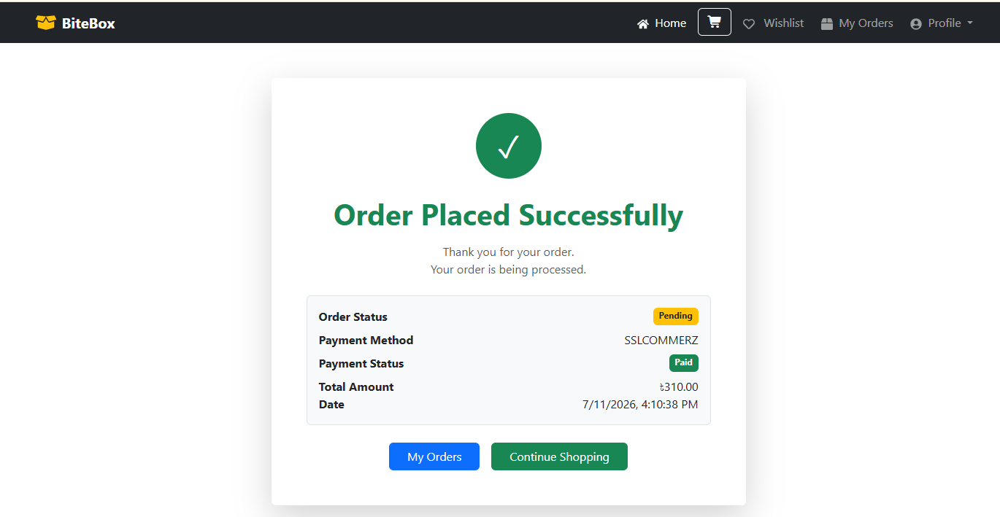
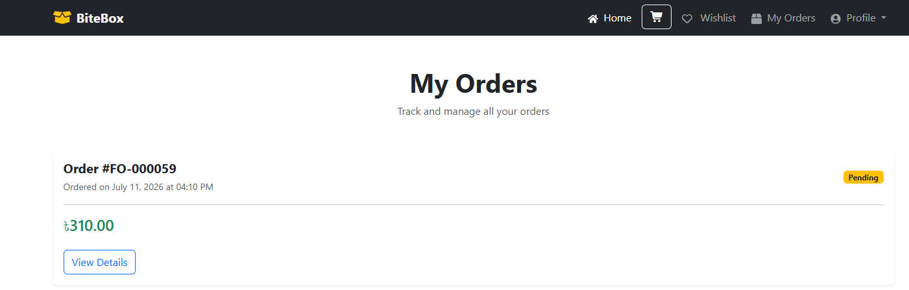
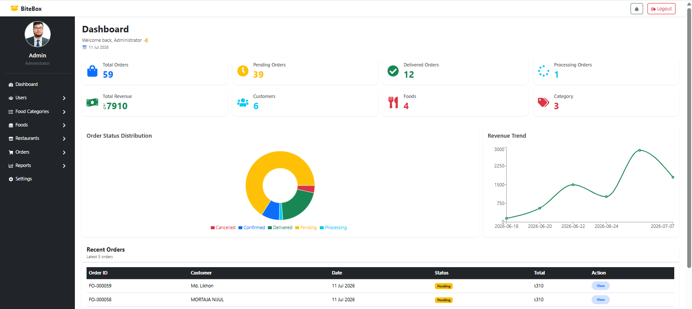
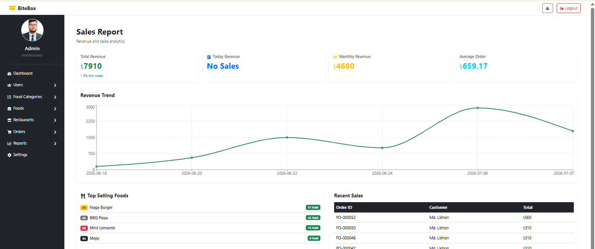
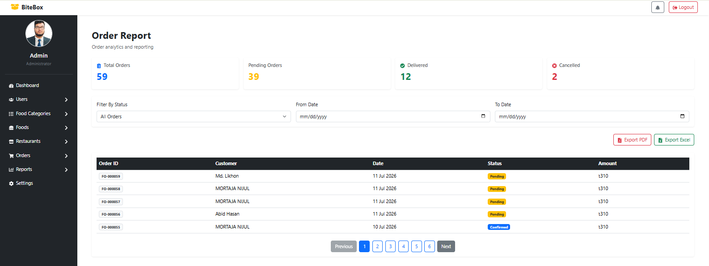

<h1 align="center">
  📦 BiteBox 
  <br>
  <span style="font-size: 0.6em; font-weight: normal;">Modern Full-Stack Food Ordering Platform</span>
</h1>

<p align="center">
  
  
  
  
</p>

<p align="center">
  A responsive, feature-rich online food ordering system designed for seamless user experience and robust administrative control. Built with a decoupled architecture using React.js and Django REST Framework.
</p>

---

## 📑 Table of Contents
- [🚀 Features](#-features)
- [🛠 Tech Stack](#-tech-stack)
- [📷 Screenshots](#-screenshots)
- [⚙️ Installation & Setup](#️-installation--setup)
- [📁 Project Structure](#-project-structure)
- [👨‍💻 Author](#-author)

---

## 🚀 Features

### 🍔 Customer Experience
- **Secure Authentication:** User registration, login, and secure session management using JWT.
- **Dynamic UI:** Auto-sliding promotional carousels, responsive navigation, and modern custom icons.
- **Smart Browsing:** Search functionality and category-based menu filtering.
- **Seamless Shopping:** Interactive shopping cart, wishlist management, and secure checkout.
- **Profile Management:** Update personal details, change passwords, and track past orders.

### 🛡️ Admin Dashboard
- **Centralized Management:** Full CRUD control over Categories, Menu Items, and Customers.
- **Order Tracking:** Real-time visibility and management of incoming orders.
- **Analytics & Reporting:** Generate and analyze detailed Sales and Order reports.
- **Data Export:** Instantly export reports to **PDF** or **Excel** formats.

---

## 🛠 Tech Stack

**Frontend:**
- React.js (Hooks, Context)
- React Router DOM (Protected Routes)
- Bootstrap 5 & Custom CSS
- Axios (API Integration)
- React Icons & React Toastify

**Backend:**
- Python 3.x
- Django & Django REST Framework (DRF)
- SimpleJWT (Token Authentication)
- MySQL Database
- ReportLab & OpenPyXL (PDF/Excel Generation)

---

## 📷 Screenshots

<details>
  <summary><b>Click to expand and view screenshots</b></summary>
  <br>
  
  ### 🏠 Home Page
  
  
  
  
  ### 🔐 Authentication
  
  
 ### 🍽️ Menu

### 🛒 Shopping Cart


### 💳 Checkout



### 💰 SSLCOMMERZ Payment


### ✅ Order Success


### 👤 User Orders


### 📊 Admin Dashboard


### 📊 Sales Report


### 📦 Order Report


</details>

---

## ⚙️ Installation & Setup

Follow these instructions to get a local copy of BiteBox up and running on your machine.

### 1. Clone the repository
```bash
git clone [https://github.com/abidhasan2422/Food-Ordering-System.git](https://github.com/abidhasan2422/Food-Ordering-System.git)
cd Food-Ordering-System

Backend Setup:
cd backend

# Create and activate virtual environment
python -m venv venv
venv\Scripts\activate      # On Windows
# source venv/bin/activate # On Mac/Linux

# Install required Python packages
pip install -r requirements.txt

# Run database migrations
python manage.py migrate

# Start the Django development server
python manage.py runserver

Frontend Setup:
cd frontend

# Install Node modules
npm install

# Start the React development server
npm run dev

📁 Project Structure
BiteBox/
│
├── backend/                  # Django REST API
│   ├── manage.py
│   ├── requirements.txt      # Python dependencies
│   └── .gitignore            # Ignores venv/, sqlite3, pycache
│
├── frontend/                 # React.js UI
│   ├── src/
│   ├── package.json
│   └── .gitignore            # Ignores node_modules/, dist/
│
├── screenshots/              # Demo images
├── .gitignore                # Root ignore (IDE settings, etc.)
└── README.md                 # Project documentation


👨‍💻 Author
Abid Hasan Likhon

LinkedIn:https://www.linkedin.com/in/md-abid-hasan-likhon-0b6402321/

GitHub: https://github.com/abidhasan2422

